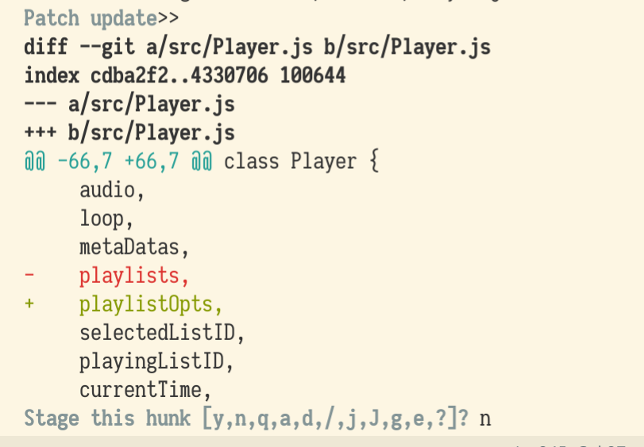

## 掌握部分提交

在重构代码时，偶尔发现之前代码的 bug，于是顺带修了，如果修改的内容与此次重构关系密切，那么最后使用 Git 提交一次是合理的，但若没有什么关系，一次性提交是让人不舒服的。那么在必要的时候怎么部分提交呢？

``` sh
$ git add -h
usage: git add [<options>] [--] <pathspec>...

    -n, --dry-run         dry run
    -v, --verbose         be verbose

    -i, --interactive     interactive picking
    -p, --patch           select hunks interactively
    ...
```

还好上课时老师演示了`git add -i`的操作我才知道可以这样。

`git add -i` 是用来做交互式暂存([Interactive Staging](https://git-scm.com/book/en/v2/Git-Tools-Interactive-Staging))的命令


如图交互式界面下可以做很多事情，这里仅说明 patch 的用法，选择`5`，再选择需要暂存的文件，这里选择`Player.js`，选择结束回车进入下一步。通过`git add -p`可以直接进入暂存补丁的界面。

在进行下一步动作之前我们要知道，一个文件的一次修改可能会产生多个补丁块，我们可以通过`git diff` 命令查看不同补丁块的内容。如图在暂存前，diff显示的两个patch：


分成多个patch是部分提交和暂存的前提，但如果修改的两段文本距离很近，就可能算在一个patch中，也就无法部分暂存，更何况提交了。

好了，现在开始选择patch。在找到需要暂存的patch之前，忽略无关patch，也就是一直输入`n`。例如，在Player类中我们只想暂存`delete`方法：



此处省略其它非`delete`方法内的忽略操作……


终于找到了，输入`y`回车以选择这个patch。如果下面还有需要暂存的patch就继续忽略无关的patch、选择需要的patch。否则可以直接输入`q`回车退出交互界面。


如图可以看到`Player.js`已经暂存了，工作区的`Player.js`也有改变未暂存。最后，使用`commit` 命令提交就完成了部分提交。


然后，将剩下的patch都提交了。


## 麻烦的钩子

因为提交的单位时patch而不是文件，所以利用`pre-commit`钩子会出现一些麻烦。

我在一个Node项目中使用`lint-staged`和`husky`工具，只需要简单的配置就能在提交特定类型文件前执行特定命令，常见用途是代码格式化和检查。

例如，在`package.json`，添加字段：


在commit前，对扩展名为`js`或`scss`已暂存的文件依次执行`prettier-eslint --write` 和 `git add`，前者格式化文件，后者将文件重新暂存。

这使部分暂存的文件格式化并且完全暂存了新的patch，于是之前辛辛苦苦通过交互式打补丁的部分暂存就白费了。

好在社区已经有人解决了这个问题，在 lint-staged issue 里找到了 [@motiz88 的方案](https://github.com/okonet/lint-staged/issues/62#issuecomment-301425613)。


motiz88 的`git-exec-and-restage`仅对完全暂存的文件进行最后的`git add`命令避免覆盖部分之前的暂存。这意味着`pre-commit`钩子修改文件的结果会出现在最后一次的完全暂存中，虽然这并不完美但也算是解决了问题了。

当然，还有其它的方案。[@benjie 使用 git stash的方案](https://github.com/okonet/lint-staged/issues/62#issuecomment-301753798)，但因为代码格式化后行号可能就变了，很容易会产生冲突，需要手动处理冲突，所以不采用。
